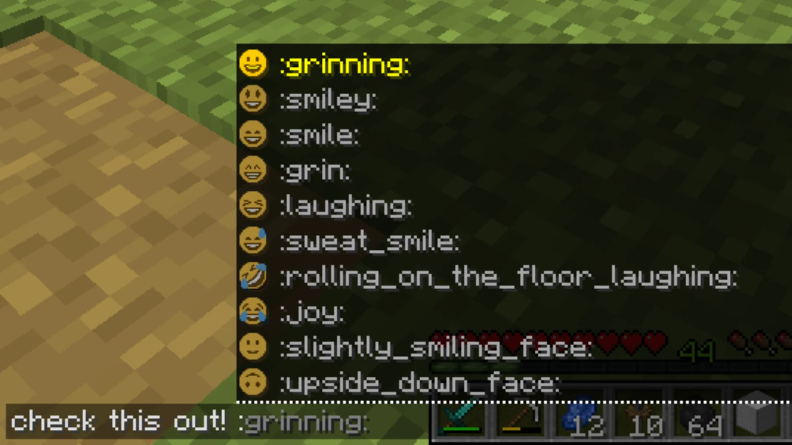
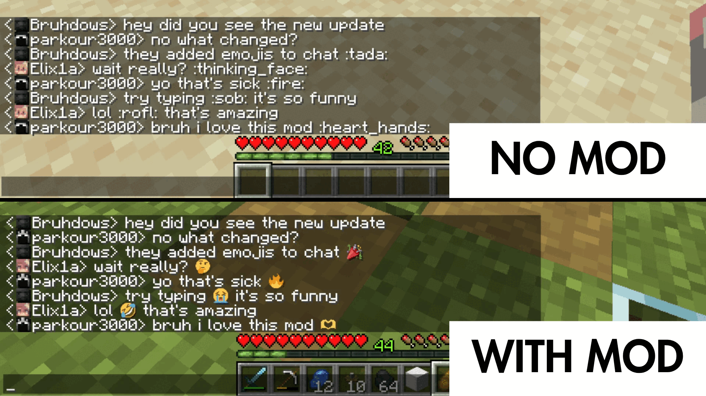

# TwemojiChat

TwemojiChat adds emoji autocomplete and Twemoji rendering to Minecraft chat.

It is client-side only, works on any server, and is built for people who want emoji support to feel native instead of bolted on.



## What It Does

- Autocompletes `:shortcode:` emoji names while you type in chat
- Accepts emoji suggestions with both `Tab` and `Enter`
- Renders both `:shortcode:` text and pasted Unicode emoji with Twemoji
- Uses Discord-style alias parity where possible, while still keeping legacy aliases searchable
- Works in normal chat without any server plugin or setup

## How It Feels In Game

- Type `:fire`, `:thumbs_up`, `:heart`, or any other supported shortcode
- Press `Tab` or `Enter` to accept the current emoji suggestion
- Keep typing normally after the emoji is inserted
- Paste Unicode emoji like `😊` and they will render with the same style

The goal is simple: emoji chat that stays fast and unobtrusive.



## Installation

1. Install Fabric, NeoForge, or Forge for your Minecraft version.
2. Download the matching TwemojiChat release.
3. Put the jar in your `mods` folder.
4. Launch the game.

No server-side install is needed.

## Supported Versions

| Minecraft | Fabric | NeoForge | Forge |
| --------- | ------ | -------- | ----- |
| 1.20.1    | Yes    |          | Yes   |
| 1.20.2    | Yes    |          | Yes   |
| 1.20.3    | Yes    |          | Yes   |
| 1.20.4    | Yes    |          | Yes   |
| 1.20.5    | Yes    | Yes      |       |
| 1.20.6    | Yes    | Yes      | Yes   |
| 1.21      | Yes    | Yes      | Yes   |
| 1.21.1    | Yes    | Yes      | Yes   |
| 1.21.2    | Yes    | Yes      |       |
| 1.21.3    | Yes    | Yes      | Yes   |
| 1.21.4    | Yes    | Yes      | Yes   |
| 1.21.5    | Yes    | Yes      | Yes   |
| 1.21.6    | Yes    | Yes      | Yes   |
| 1.21.7    | Yes    | Yes      | Yes   |
| 1.21.8    | Yes    | Yes      | Yes   |
| 1.21.9    | Yes    | Yes      | Yes   |
| 1.21.10   | Yes    | Yes      | Yes   |
| 1.21.11   | Yes    | Yes      | Yes   |
| 26.1.2    | Yes    | Yes      | Yes   |

Forge coverage follows upstream Forge availability. There are no Forge releases for some skipped Minecraft lines such as `1.20.5` and `1.21.2`.

## Emoji Aliases

TwemojiChat keeps compatibility aliases for search and replacement, but it now prefers more familiar names where possible.

Examples:

- `:thumbs_up:` is preferred, while older aliases like `:+1:` still resolve
- `:flag_us:` is available instead of raw fallback names
- Unicode fallback-only entries are given better display aliases when a maintained shortcode source exists

This makes autocomplete more useful without breaking old habits.

## Developer Notes

This repository is split into shared code plus loader-specific modules:

```text
common/     shared logic, mixins, tests, generated emoji assets
fabric/     Fabric loader modules by version line
forge/      Forge loader modules by version line
neoforge/   NeoForge loader modules by version line
tools/      Twemoji sync script and shortcode source configuration
```

### Requirements

- Java 21+ for current lines
- Java 25 for `26.1.x`
- Python 3
- Pillow

### Build

```bash
./gradlew build
```

If you only want a smaller slice of the matrix while working:

```bash
./gradlew -Pci.include=common:1_21_11,fabric:1_21_11 :common:1_21_11:build :fabric:1_21_11:build
```

### Run A Development Client

```bash
./gradlew :fabric:1_21_11:runClient
./gradlew :neoforge:1_21_11:runClient
./gradlew :forge:1_21_11:runClient
```

### Update Emoji Data

TwemojiChat generates its emoji index and font sheets from upstream data sources.

1. Update `tools/twemoji_sources.json` if you need new upstream refs or alias rules.
2. Run:

```bash
./gradlew syncTwemoji
```

3. Review the generated asset changes in:

```text
common/src/generated/resources
```

The sync pipeline currently combines:

- Twemoji artwork from `jdecked/twemoji`
- Shortcode data from `iamcal/emoji-data`
- A Discord-style alias parity source from Emojibase

## Credits

- Twemoji artwork: https://github.com/jdecked/twemoji
- Shortcode data: https://github.com/iamcal/emoji-data
- Discord-style shortcode parity source: https://emojibase.dev/

## License

MIT
